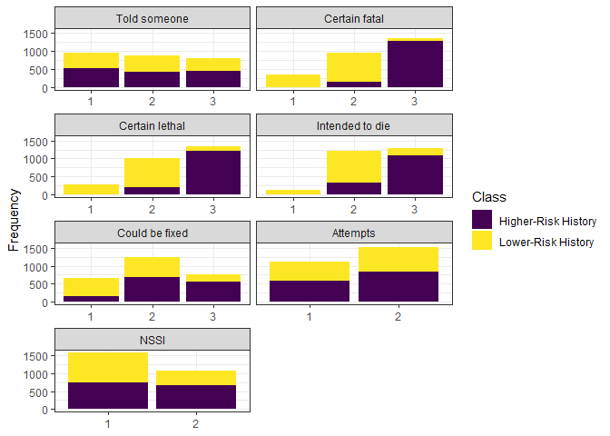

Results MSRC latent class analysis
================
08 February, 2021

**NOTE: I’ve written a first-glance interpretation of the results as a
placeholder. Please interpret the results substantively at your own
discretion.**

This manuscript uses the Workflow for Open Reproducible Code in Science
(Van Lissa et al. 2020) to ensure reproducibility and transparency. All
code <!--and data--> are available at
<https://github.com/cjvanlissa/MSRC_LPA>.

<!--The function below inserts a notification if the manuscript is knit using synthetic data. Make sure to insert it after load_data().-->

## 0.1 Descriptive statistics

## 0.2 Analysis

We conducted a latent class analysis for 1-7 classes in Mplus 8.4. All
latent class indicators were coded as categorical. Class membership for
categorical variables is determined by the proportion of responses in
each category. We used tidyLPA to determine the optimum number of
classes (see Table <a href="#tab:tabres">1</a>). According to the BIC,
the model fit improved dramatically from a one-class solution to a
two-class solution, and continued improving until a five-class solution.
According to the bootstrapped likelihood ratio test, model fit improved
significantly with an increasing number of classes. However, all
solutions with more than two classes had low posterior classification
probabilities (\<= .77), and the smallest class contained only
approximately 10% of all cases. We thus selected a two-class solution
for our final analysis. Note that the entropy for all models is low,
which indicates that classes are not clearly separable.

| Classes |      AIC |      BIC | Entropy | prob\_min | prob\_max | n\_min | n\_max | BLRT\_p |
| ------: | -------: | -------: | ------: | --------: | --------: | -----: | -----: | ------: |
|       1 | 40946.07 | 41051.93 |    1.00 |      1.00 |      1.00 |   1.00 |   1.00 |         |
|       2 | 38588.71 | 38806.33 |    0.75 |      0.91 |      0.93 |   0.46 |   0.54 |       0 |
|       3 | 37811.95 | 38141.32 |    0.77 |      0.77 |      0.94 |   0.10 |   0.50 |       0 |
|       4 | 37375.90 | 37817.01 |    0.75 |      0.76 |      0.93 |   0.10 |   0.45 |       0 |
|       5 | 37205.95 | 37758.82 |    0.69 |      0.72 |      0.84 |   0.10 |   0.29 |       0 |
|       6 | 37108.28 | 37772.90 |    0.70 |      0.75 |      0.83 |   0.05 |   0.29 |       0 |
|       7 | 37052.18 | 37828.55 |    0.68 |      0.67 |      0.84 |   0.05 |   0.22 |       0 |

Table 1: Fit of latent class models

## 0.3 Final model

For all indicator variables, the proportion of responses by response
category and latent class are displayed in Figure
<a href="#fig:figpresprob">1</a>. These same results are rescaled to the
approximate number of participants per class (based on summed posterior
class probabilities) in Figure <a href="#fig:figpres">2</a>. Both
figures show that participants in the first class were relatively more
likely to report higher scores on being certain that their attempt would
be fatal and lethal, intent to die, and a belief that their attempt
could not be fixed by medical attention, as compared to participants in
the second class. Participants in the first class were relatively less
likely to report a history of NSSI.

Figure 1: Results of the two-class latent class model. Proportion of
responses by response category and latent class.

Figure 2: Results of the two-class latent class model. Proportion of
responses by response category and latent class, rescaled to the number
of participants per latent class (based on posterior class probability).

## 0.4 Auxiliary variables

We were interested in whether these classes differed on two outcome
variables and several covariates. To prevent the inclusion of these
auxiliary variables from influencing the latent class measurement model,
we used the three-step method described by Asparouhov and Muthén (2014).
Results for continuous auxiliary variables are displayed in Table
<a href="#tab:tabcont">2</a>, and results for categorical auxiliary
variables are displayed in Table <a href="#tab:tabcat">3</a>. All
auxiliary variables differed significantly across the two classes.

With regard to the method of the attempt, the most notable differences
between the classes were that the first class was more likely than the
second to report shooting as a method, and the second class was more
likely than the first to report cutting as a method. With regard to the
amount of medical attention required, the first class scored
significantly higher than the second.

With regard to the covariates, the first class consisted of a relatively
larger proportion of males than the second class. The first class was
significantly older and lower educated than the second. The first class
was relatively more likely to be currently serving or a veteran, whereas
the second class was relatively more likely to have no military service
record. Although there was a significant association between class
membership and race, the chi square value was small, and no clear
pattern emerged from the results.

| Variable               |   m.1 | se.1 |   m.2 | se.2 | chisq  | p     |
| :--------------------- | ----: | ---: | ----: | ---: | :----- | :---- |
| Medical attention (DV) |  3.10 | 0.05 |  2.46 | 0.05 | 73.386 | 0     |
| Age (cov)              | 35.48 | 0.41 | 31.30 | 0.41 | 44.13  | 0     |
| Education (cov)        |  2.78 | 0.03 |  2.91 | 0.03 | 9.735  | 0.002 |

Table 2: Class differences in continuous auxiliary variables.

| Variable      | Category                                     | Prob.1 | Prob.2 | chisq  | p     |
| :------------ | :------------------------------------------- | :----- | :----- | :----- | :---- |
| Method (DV)   | Cutting                                      | 0.136  | 0.202  | 53.095 | 0.000 |
|               | Hanging/Asphyxiation                         | 0.131  | 0.122  |        |       |
|               | Jumping                                      | 0.049  | 0.055  |        |       |
|               | Other Method                                 | 0.066  | 0.075  |        |       |
|               | Overdose                                     | 0.491  | 0.503  |        |       |
|               | Shooting                                     | 0.128  | 0.043  |        |       |
| Gender (cov)  | Female                                       | 0.333  | 0.466  | 34.537 | 0.000 |
|               | Male                                         | 0.667  | 0.534  |        |       |
| Race (cov)    | Asian                                        | 0.025  | 0.040  | 14.356 | 0.026 |
|               | Black/African American                       | 0.142  | 0.166  |        |       |
|               | Multiracial                                  | 0.025  | 0.011  |        |       |
|               | Native American/Native Alaskan               | 0.018  | 0.010  |        |       |
|               | Other (sometimes Hispanic)                   | 0.092  | 0.097  |        |       |
|               | Pacific Islander                             | 0.004  | 0.002  |        |       |
|               | White/Caucasian                              | 0.693  | 0.675  |        |       |
| Service (cov) | Currently Serving                            | 0.355  | 0.309  | 30.634 | 0.000 |
|               | No Military Service                          | 0.265  | 0.389  |        |       |
|               | served but unclear if still serving (cougle) | 0.002  | 0.003  |        |       |
|               | Veteran                                      | 0.379  | 0.300  |        |       |

Table 3: Class differences in categorical auxiliary variables.

Asparouhov, Tihomir, and Bengt Muthén. 2014. “Auxiliary Variables in
Mixture Modeling: Three-Step Approaches Using Mplus.” *Structural
Equation Modeling: A Multidisciplinary Journal* 21 (3): 329–41.
<https://doi.org/10.1080/10705511.2014.915181>.

Van Lissa, Caspar J., Andreas M. Brandmaier, Loek Brinkman, Anna-Lena
Lamprecht, Aaron Peikert, Marijn E. Struiksma, and Barbara Vreede. 2020.
“WORCS: A Workflow for Open Reproducible Code in Science,” May.
<https://doi.org/10.17605/OSF.IO/ZCVBS>.

